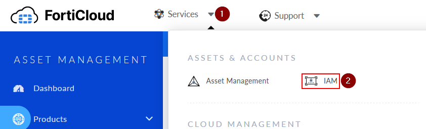
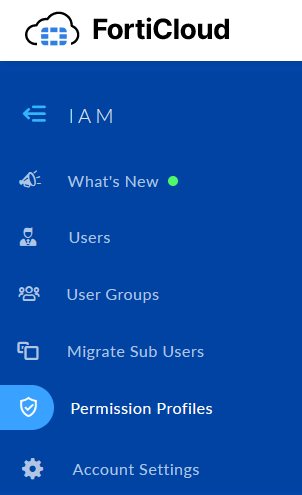
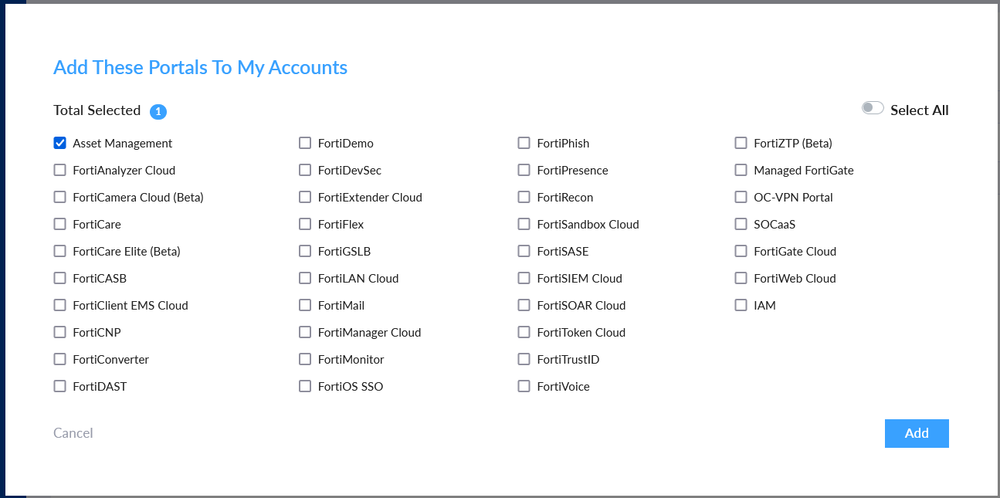
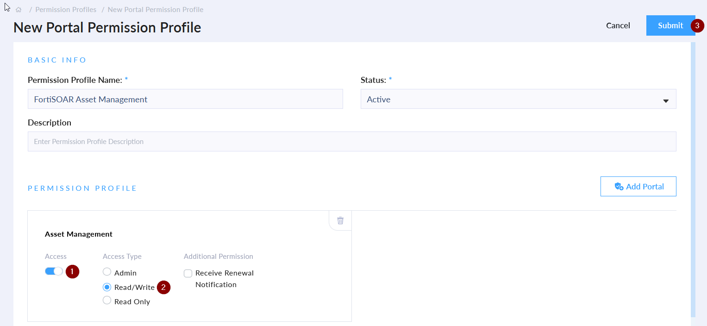
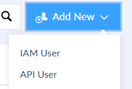
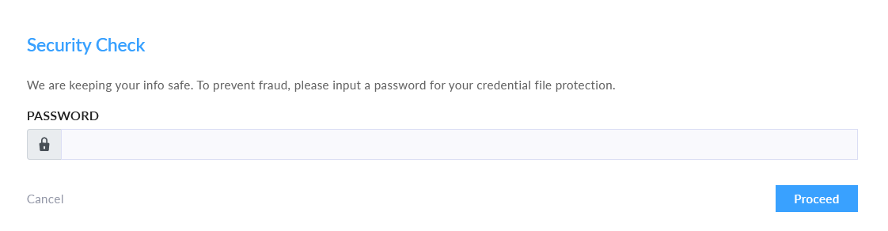

## About the connector
Asset Management is an easy-to-use portal to register, organize and view all Fortinet products and services in FortiCloud. New products, licenses, or contracts can be registered and managed with the Asset Management portal. Registered products are displayed in the Product List as well as a customizable folder structure called My Assets.

This document provides information about the FortiCloud Asset Management Connector, which facilitates automated interactions, with a FortiCloud Asset Management server using FortiSOAR&trade; playbooks. Add the FortiCloud Asset Management Connector as a step in FortiSOAR&trade; playbooks and perform automated operations with FortiCloud Asset Management.

### Version information

Connector Version: 1.0.0

Authored By: Fortinet CSE

Certified: No
## Installing the connector

Use the <strong>Content Hub</strong> to install the connector. For the detailed procedure to install a connector, click <a href="https://docs.fortinet.com/document/fortisoar/0.0.0/installing-a-connector/1/installing-a-connector" target="_top">here</a>.

You can also use the <code>yum</code> command as a root user to install the connector:

<pre>yum install cyops-connector-forticloud-asset-management</pre>

## Prerequisites to configuring the connector
- You must have the credentials of FortiCloud Asset Management server to which you will connect and perform automated operations.
- The FortiSOAR&trade; server should have outbound connectivity to port 443 on the FortiCloud Asset Management server.

## Create an API User in FortiCloud

For the procedure to configure this connector, follow the steps below. 

> **Note**
> In order to perform these steps, you must have a user account with the correct privileges. If you don't see IAM, contact your account owner.  https://docs.fortinet.com/document/forticloud/23.3.0/identity-access-management-iam/670315/requirements

1. Login to https://support.fortinet.com.
2. Click **Services**, then under "Assets & Accounts" click **IAM**.

3. On the left pane, click **Permission Profiles**

    

5. Click **Add New**

    

7. Click **Add Portal**

    

8. Check the box to the left of **Asset Management** and click **Add**

9. Provide a **Permission Profile Name**. This example will use `FortiSOAR Asset Management`
10. Toggle the **Access** slider to enable the portal, then click **Read/Write** option, then click the **Submit** button to save

11. Navigate to the Users Section as seen from the image on step 3
12. Click **Add New > API User** 

    
14. Select the **Permission Profile** `FortiSOAR Asset Management` , then click Next

15. Click Confirm 
16. Download the credentials for the api user. These are required to configure the connector

    
17. Provide a password to encrypt the file, then click **Proceed**

## Configure the Connector
1. Locate the downloaded credentials for the API User
2. Open the file with the password used to encrypt the file.
3. Open the **FortiCloud Asset Management** connector from the content Hub
4. Fill in the required fields for the connector

## Minimum Permissions Required
- Not applicable

## Configuring the connector
For the procedure to configure a connector, click [here](https://docs.fortinet.com/document/fortisoar/0.0.0/configuring-a-connector/1/configuring-a-connector)
### Configuration parameters

In FortiSOAR&trade;, on the Connectors page, click the <strong>FortiCloud Asset Management</strong> connector row (if you are in the <strong>Grid</strong> view on the Connectors page) and in the <strong>Configurations</strong> tab enter the required configuration details:

<table border=1><thead><tr><th>Parameter</th><th>Description</th></tr></thead><tbody><tr><td>Server URL</td><td>The server url SOAR will use to communicate with.
</td>
</tr><tr><td>API ID</td><td>The API ID is the username for IAM user obtained from Forticloud. It is in UUID format, ie XXXXXXXX-XXXX-XXXX-XXXX-XXXXXXXXXXXX
</td>
</tr><tr><td>Password</td><td>Provide the password for IAM user obtained from Forticloud. 
</td>
</tr><tr><td>Client ID</td><td>Provide the Client ID for Forticloud site, ie assetmanagement
</td>
</tr><tr><td>Verify SSL</td><td>Specifies whether the SSL certificate for the server is to be verified or not.  By default, this option is set to True.</td></tr>
</tbody></table>
## Actions supported by the connector
The following automated operations can be included in playbooks and you can also use the annotations to access operations from FortiSOAR&trade; release 4.10.0 and onwards:
<table border=1><thead><tr><th>Function</th><th>Description</th><th>Annotation and Category</th></tr></thead><tbody><tr><td>List Assets</td><td>Returns product list based on product SN search pattern or support package expiration date</td><td>list_assets  Investigation</td></tr>
<tr><td>Register Product</td><td>Register products/contracts in one request. Required permission: ReadWrite/Admin</td><td>register_product  Investigation</td></tr>
<tr><td>Update Description</td><td>Update description of a product using serial number. Required permission: ReadWrite/Admin</td><td>update_description  Investigation</td></tr>
<tr><td>Get Product Details</td><td>Returns product detailed information, including active support coverage and associated licenses</td><td>product_details  Investigation</td></tr>
<tr><td>Update Location</td><td>Update Location of a product using serial number. Required permission: ReadWrite/Admin</td><td>update_location  Investigation</td></tr>
<tr><td>Decommission Product</td><td>Decommission one or more products</td><td>decommission_product  Investigation</td></tr>
<tr><td>Register License</td><td>Used for registering a license.
Required permission: ReadWrite/Admin</td><td>register_license  Investigation</td></tr>
<tr><td>Download License</td><td>Used for license key file download
Required permission: ReadWrite/Admin</td><td>download_license  Investigation</td></tr>
<tr><td>Generic API Call</td><td>This action takes a Method, Endpoint, and Payload as input and makes the api call to FortiCloud</td><td>generic_api_call  Investigation</td></tr>
<tr><td>Register Service</td><td>Register a subscription contract (e.g. VM-S) to generate serial number
Required permission: ReadWrite/Admin</td><td>register_service  Investigation</td></tr>
</tbody></table>
### operation: List Assets
#### Input parameters
<table border=1><thead><tr><th>Parameter</th><th>Description</th></tr></thead><tbody><tr><td>Serial Number</td><td>Serial number or serial number search pattern
</td></tr><tr><td>Expire Before</td><td> Date time in ISO 8601 format
</td></tr></tbody></table>
#### Output

 The output contains a non-dictionary value.
### operation: Register Product
#### Input parameters
<table border=1><thead><tr><th>Parameter</th><th>Description</th></tr></thead><tbody><tr><td>Serial Number</td><td>Serial number or serial number search pattern
</td></tr><tr><td>Contract Number</td><td>Register contract with product
</td></tr><tr><td>Description</td><td>Set product description during registration process
</td></tr><tr><td>Asset Group Ids</td><td>Register product under certain asset group, multiple asset group allowed
</td></tr><tr><td>Replaced Serial Number</td><td>Used for product RMA registration for replaced product serial number
</td></tr><tr><td>Additional Info</td><td>Store extra info for certain product registration, for example system ID, IP address etc.
</td></tr><tr><td>Cloud Key</td><td>Cloud key to be used in product registration
</td></tr><tr><td>Is Government</td><td>Whether the product will be used for government or not
</td></tr></tbody></table>
#### Output

 The output contains a non-dictionary value.
### operation: Update Description
#### Input parameters
<table border=1><thead><tr><th>Parameter</th><th>Description</th></tr></thead><tbody><tr><td>Serial Number</td><td>Product serial number
</td></tr><tr><td>Description</td><td>Description for product
</td></tr></tbody></table>
#### Output

 The output contains a non-dictionary value.
### operation: Get Product Details
#### Input parameters
<table border=1><thead><tr><th>Parameter</th><th>Description</th></tr></thead><tbody><tr><td>Serial Number</td><td>Serial number
</td></tr></tbody></table>
#### Output

 The output contains a non-dictionary value.
### operation: Update Location
#### Input parameters
<table border=1><thead><tr><th>Parameter</th><th>Description</th></tr></thead><tbody><tr><td>Serial Number</td><td>Product serial number
</td></tr><tr><td>Company</td><td>Company name
</td></tr><tr><td>Address</td><td>Address of the location
</td></tr><tr><td>City</td><td>City name
</td></tr><tr><td>State/Province</td><td>State or province name 
</td></tr><tr><td>Country</td><td>Two letter country code
</td></tr><tr><td>Postal Code</td><td>Zip/postal code of the location
</td></tr><tr><td>Email</td><td>Email address
</td></tr><tr><td>Phone</td><td>Phone number
</td></tr><tr><td>Fax</td><td>Fax number
</td></tr></tbody></table>
#### Output

 The output contains a non-dictionary value.
### operation: Decommission Product
#### Input parameters
<table border=1><thead><tr><th>Parameter</th><th>Description</th></tr></thead><tbody><tr><td>Serial Numbers</td><td>Decommission products using serial number
</td></tr></tbody></table>
#### Output

 The output contains a non-dictionary value.
### operation: Register License
#### Input parameters
<table border=1><thead><tr><th>Parameter</th><th>Description</th></tr></thead><tbody><tr><td>Serial Number</td><td>Optional product serial number, if this field is not empty, the license will be registered under it, otherwise a virtual product will be created for the registered license (if applicable)
</td></tr><tr><td>License Registration Code</td><td>License registration code
</td></tr><tr><td>Description</td><td>Optional, the description for the new product
</td></tr><tr><td>Additional Info</td><td>Store extra info for certain product registration, for example system ID, IP address etc.
</td></tr><tr><td>Is Government</td><td>Product will be used for government or not
</td></tr></tbody></table>
#### Output

 The output contains a non-dictionary value.
### operation: Download License
#### Input parameters
<table border=1><thead><tr><th>Parameter</th><th>Description</th></tr></thead><tbody><tr><td>Serial Number</td><td>Product serial number
</td></tr></tbody></table>
#### Output

 The output contains a non-dictionary value.
### operation: Generic API Call
#### Input parameters
<table border=1><thead><tr><th>Parameter</th><th>Description</th></tr></thead><tbody><tr><td>Method</td><td>The HTTP Method to use
</td></tr><tr><td>Endpoint</td><td>Provide the endpoint for the action, ie /products/list,  /products/register etc. The full list of available actions are accessible from FNDN at https://fndn.fortinet.net/index.php?/fortiapi/55-asset-management-formerly-forticare-registration/2212/55/Product
</td></tr><tr><td>Payload</td><td>The payload needed for the call. Use empty brackets if there is no payload.
</td></tr></tbody></table>
#### Output

 The output contains a non-dictionary value.
### operation: Register Service
#### Input parameters
<table border=1><thead><tr><th>Parameter</th><th>Description</th></tr></thead><tbody><tr><td>Contract Number</td><td>Optional product serial number, if this field is not empty, the license will be registered under it, otherwise a virtual product will be created for the registered license (if applicable)
</td></tr><tr><td>Description</td><td>Optional, the description for the new product
</td></tr><tr><td>Additional Info</td><td>Store extra info for certain product registration, for example system ID, IP address etc.
</td></tr><tr><td>Is Government</td><td>Product will be used for government or not
</td></tr></tbody></table>
#### Output

 The output contains a non-dictionary value.
## Included playbooks
The `Sample - forticloud-asset-management - 1.0.0` playbook collection comes bundled with the FortiCloud Asset Management connector. These playbooks contain steps using which you can perform all supported actions. You can see bundled playbooks in the **Automation** > **Playbooks** section in FortiSOAR&trade; after importing the FortiCloud Asset Management connector.

- Decommisson Product
- Download License
- Generic API Call
- Get Product Details
- List Assets
- Register License
- Register Product
- Register Service
- Update Location
- Update Product Description

**Note**: If you are planning to use any of the sample playbooks in your environment, ensure that you clone those playbooks and move them to a different collection since the sample playbook collection gets deleted during connector upgrade and delete.
